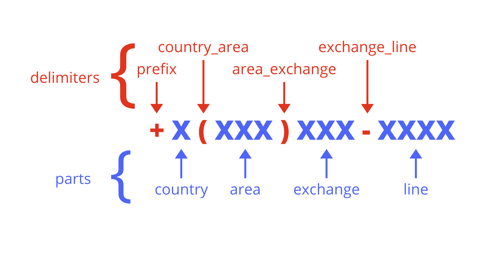

# PhoneHelper

A super easy to use phone number formatter for Laravel.  Note - Only works on north american phone numbers.


## Getting Started / Installation

```sh
composer require hallindavid/phonehelper
```

Laravel should autodiscover the Provider & Alias.

You should now be able to use the PhoneHelper alias to format phone numbers.

eg:

```php
PhoneHelper::format('12345678912');
// defult result: 234-567-8912
```

## Usage

For basic usage, you can use the alias `PhoneHelper` and the format function

```php
use PhoneHelper;

class TestController extends Controller
{
    public function index()
    {
        $newPhone = PhoneHelper::format('12345678912');
    }
}
```

## Using Different Formats

By default the PhoneHelper comes with these formats

| Format                                   | Output (with 8888888888888) entered |
|------------------------------------------|-----------------------------------------|
| 10                                       | 8888888888                              |
| 10-dash (default)                        | 888-888-8888                            |
| 10-brack                                 | (888) 888-8888                          |
| 10-brack-ext                             | (888) 888-8888 ext. 888                 |
| 10-dot                                   | 888.888.8888                            |
| 11                                       | 18888888888                             |
| 11-dash                                  | 1-888-888-8888                          |
| 11-brack                                 | 1 (888) 888-8888                        |
| 11-dot                                   | 1.888.888.8888                          |
| +11-brack                                | +1 (888) 888-8888                       |
| E.164 (useful for Twilio and other apis) | +18888888888                            |

I've also started working on extensions, but am just shy of finishing that quite yet.  It'll be out shortly.

## Creating/Modifying Formats

You can publish the configuration

```sh
php artisan vendor:publish --provider="Hallindavid\PhoneHelper\PhoneHelperServiceProvider"
```

This will create the configuration file: `app/config/phonehelper.php`

From here you are able to add/remove/edit formats and there are lots of comments which can help you do that.

This image identifies the difference pieces of the phone number formatter.


And here is a sample format

```php
'my-custom-format'=> [
    'parts'=>['country','area','exchange','line','extension'],
    'delimiters'=>[
        'prefix'=> '+',
        'country_area'=> ' (',
        'area_exchange'=> ') ',
        'exchange_line'=>'-',
        'line_extension'=>' ext. ',
    ]
],
```

After setting this up - you could execute this

```php
PhoneHelper::format('8888888888888', 'my-custom-format');
// +1 (888) 888-8888 ext. 888
```

## Testing

There are a tonne of tests for the packaged formats - to run them, pull the package then

```sh
composer install
composer test
```

## Support

To say thanks, you can share the project on social media or <br />

<a href="https://www.buymeacoffee.com/tDbQ4kg" target="_blank"></a>

## Issues

Please report all issues in the GitHub Issue tracker

## Contributing

Shoot me an email, or DM me on twitter and I am happy to allow other contributors.
